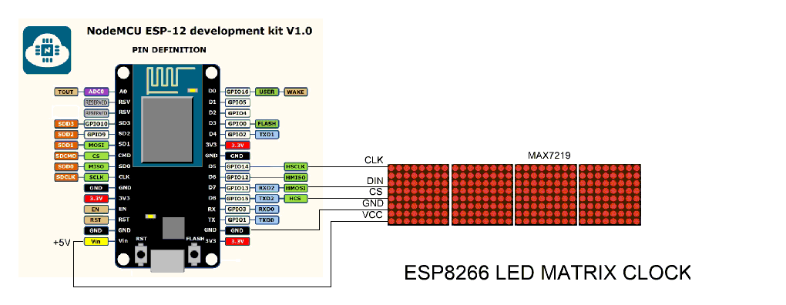

# EspMatrixClock

主控采用Esp12F，显示采用Max7219的LED 8*8 点阵屏（4块）

### DONE
- 显示时间
### TODO
- AP配网
- 定时调节屏幕亮度（比如23点屏幕变暗，8点屏幕亮度恢复正常）
- DS18B20温度采集
- 驱动板载WS2812B LED，显示一些状态，比如推送提醒，温度范围
- 驱动板载GL5539光敏电阻，达到光线控制屏幕亮度目的
- 按键切换温度和时间（或者日期）

### 接线示意图

